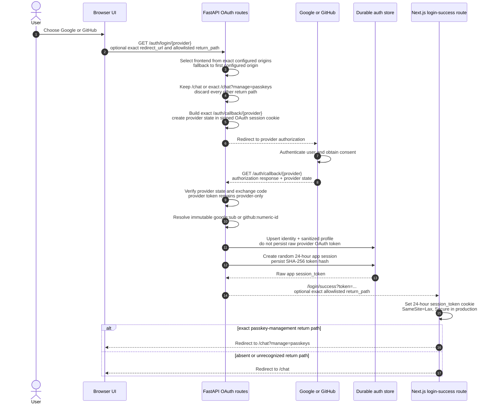
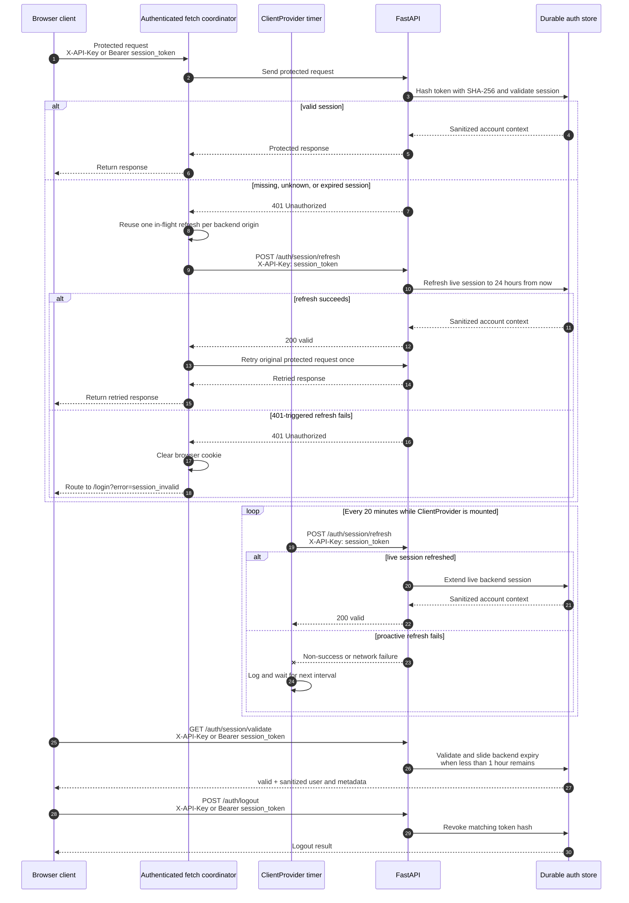

# OAuth Authentication

Google and GitHub provide account authentication; FastAPI owns provider
exchange, durable identity, and application sessions; Next.js converts the
backend success redirect into the browser's `session_token` cookie; browser
clients present that application token on protected backend requests.

Return to [documentation index](../README.md).

## Architecture and trust boundaries

| Layer                         | Responsibility                                                                                                                                                                                                 |
| ----------------------------- | -------------------------------------------------------------------------------------------------------------------------------------------------------------------------------------------------------------- |
| Browser UI                    | Offer Google/GitHub choice, begin login against FastAPI, consume only frontend redirects, and send current application session token on protected requests.                                                     |
| Next.js login-success route   | Read token from `/login/success`, set 24-hour `session_token` cookie, and redirect only to `/chat` or exact allowlisted passkey-management destination.                                                          |
| FastAPI OAuth routes          | Select allowed frontend, construct exact provider callback, own provider exchange and state checks, resolve immutable identity, create/validate/refresh/revoke application sessions, and sanitize session-validation responses. |
| Google or GitHub              | Authenticate user, validate registered callback, and return provider authorization response. Provider state and provider tokens are not application sessions.                                                  |
| Durable auth store            | Upsert provider account and sanitized profile, persist only SHA-256 application-token hashes, enforce expiry, and share session state through SQLite, PostgreSQL, or Cosmos DB adapter.                         |

Browser begins OAuth at backend `GET /auth/login/{provider}`. Backend owns
provider authorization exchange and app-session creation. Frontend never
exchanges provider codes or treats provider access token as app credential.
After callback, backend redirects to Next.js login-success route. That route
sets `session_token` and selects `/chat` unless return path is exactly
`/chat?manage=passkeys`; no arbitrary path, absolute URL, or caller-controlled
destination is accepted. Protected browser requests then present session token
to backend in `X-API-Key` or `Authorization: Bearer`.

## 1. Login and callback



Frontend origin selection and post-login navigation are different controls.
`redirect_url`, when supplied, must equal a configured frontend origin. Backend
can also select an exact configured origin from request `Referer`, then falls
back to first configured origin. `return_path` never selects an origin; current
allowlist contains only `/chat?manage=passkeys`, and normal destination is
`/chat`. Both backend before callback and Next.js after callback apply exact
return-path check.

OAuth library stores state and flow metadata in signed session cookie protected
by `OAUTH_SECRET_KEY`. Google authorization response or GitHub access token is
used only by backend to load provider identity and profile. App
`session_token` is separately generated random bearer credential. Raw provider
OAuth tokens are not persisted, returned by validation, or accepted as
application session.

Provider subject defines account: Google uses stable `sub`; GitHub uses numeric
user ID. Email, display name, avatar, and bounded provider metadata are mutable
sanitized profile fields. Google and GitHub accounts are never linked merely
because email addresses match.

## 2. Application session lifecycle



New backend session and Next.js cookie both start with 24-hour lifetime. Backend
`GET /auth/session/validate` automatically extends still-live backend record to
24 hours from validation when less than one hour remains. Explicit
`POST /auth/session/refresh` extends any still-live backend session to 24 hours
from request. Neither operation changes original authentication time.

Current browser refresh client keeps same raw token and does not renew cookie's
original `Max-Age`; browser cookie can therefore expire after 24 hours even when
backend record was extended. While mounted, `ClientProvider` starts a 20-minute
timer that calls refresh; proactive failure only logs and waits for next
interval. Separately, authenticated fetch retries after a protected request
returns 401, coordinates one refresh promise per request origin, excludes auth
endpoints from recursive refresh, and retries original request once after
successful refresh. Only failed 401-triggered refresh clears cookie and routes
to login.

Backend accepts app session token in `X-API-Key` or exact
`Authorization: Bearer <session-token>` form for validation, refresh, logout,
and protected application surfaces that support sessions. Store never persists
raw app token: lookup, refresh, and revocation use SHA-256 token hash. Validation
returns normalized identity, email, name, provider, avatar, optional passkey
authentication method, and sanitized metadata; it excludes raw provider token
and `session_token`.

## Endpoints

| Method and route                        | Authentication in | Result and trust behavior                                                                                                                                      |
| --------------------------------------- | ----------------- | -------------------------------------------------------------------------------------------------------------------------------------------------------------- |
| `GET /auth/login/{provider}`            | None              | Accepts `google` or `github`; selects exact allowlisted frontend and safe return path, stores flow state in signed cookie, then redirects to provider.          |
| `GET /auth/callback/{provider}`         | Provider state    | Validates provider response, creates app session, then redirects to selected frontend `/login/success?token=...`; callback must exactly match provider setup. |
| `GET /auth/session/validate`            | Session header    | Returns sanitized user/metadata for live session; slides backend expiry when less than one hour remains; otherwise 401.                                       |
| `POST /auth/session/refresh`            | Session header    | Extends live backend session by 24 hours without changing authentication time; otherwise 401.                                                                 |
| `POST /auth/logout`                     | Session header    | Revokes session; missing token returns 401 and unknown/already-expired session returns 404.                                                                    |

`Session header` means either `X-API-Key: <session-token>` or
`Authorization: Bearer <session-token>`. Static API-key acceptance differs by
protected surface; do not assume static key is OAuth session.

## Provider and backend setup

Create provider applications with placeholder values first; put real values in
deployment secret manager, never documentation or source control.

```dotenv
GOOGLE_CLIENT_ID="<google-web-client-id>"
GOOGLE_CLIENT_SECRET="<google-web-client-secret>"
GITHUB_CLIENT_ID="<github-oauth-app-client-id>"
GITHUB_CLIENT_SECRET="<github-oauth-app-client-secret>"
FRONTEND_URLS="https://<frontend-one.example>,https://<frontend-two.example>"
OAUTH_SECRET_KEY="<stable-random-session-signing-secret>"
AUTH_STORE_TYPE="<sqlite-or-postgres-or-cosmosdb>"
```

Register these exact backend callback shapes, substituting externally visible
backend origin without trailing slash:

```text
https://<backend-origin>/auth/callback/google
https://<backend-origin>/auth/callback/github
```

Google web client also needs each frontend origin as authorized JavaScript
origin and `openid email profile` consent scopes. GitHub OAuth app uses frontend
as Homepage URL and exact backend callback as Authorization callback URL; its
client secret is not personal access token.

For multiple frontend domains, optional GitHub mappings must contain matching
domain keys in both variables:

```dotenv
GITHUB_CLIENT_IDS="<frontend-one.example>:<client-id>,<frontend-two.example>:<client-id>"
GITHUB_CLIENT_SECRETS="<frontend-one.example>:<client-secret>,<frontend-two.example>:<client-secret>"
```

Keep default `GITHUB_CLIENT_ID` and `GITHUB_CLIENT_SECRET` when fallback client
is required. Missing secret for mapped domain yields unusable client.

`FRONTEND_URLS` is comma-separated exact frontend origins. Include scheme,
hostname, and non-default port; omit path and normalize trailing slash. Keep
`OAUTH_SECRET_KEY` unpredictable and stable across deploys, restarts, and
replicas or in-flight signed OAuth state cookies fail validation. Never expose
OAuth client secrets, `OAUTH_SECRET_KEY`, database credentials, or other backend
secrets through `NEXT_PUBLIC_*`. Public backend URL may be public configuration;
provider and signing secrets may not.

## Durable auth store

Select supported adapter and supply its backend configuration through secret or
deployment configuration:

| Store      | Selection                     | Use                                                                                                                                       |
| ---------- | ----------------------------- | ----------------------------------------------------------------------------------------------------------------------------------------- |
| SQLite     | `AUTH_STORE_TYPE=sqlite`       | Local or single-replica deployment. Set persistent `SQLITE_DB_PATH`; default `:memory:` is not durable. Azure Files/SMB also needs `AUTH_SQLITE_JOURNAL_MODE=DELETE`. |
| PostgreSQL | `AUTH_STORE_TYPE=postgres`     | Multi-replica production. Configure `DATABASE_URL`/`POSTGRES_URL` or PostgreSQL connection variables.                                    |
| Cosmos DB  | `AUTH_STORE_TYPE=cosmosdb`     | Multi-replica production. Configure connection string or endpoint/key and database/container settings.                                  |

`DB_TYPE` remains fallback selector when `AUTH_STORE_TYPE` is absent. Accounts
store immutable provider/subject plus sanitized mutable profile. Sessions store
token hash, account reference, timestamps, expiry, and authentication method.
Raw provider OAuth tokens and raw app session tokens are not persisted.

## Production security boundaries

- Serve frontend, OAuth callbacks, success redirect, and protected APIs over
  HTTPS. Register callback scheme, host, port, and path character for character.
- FastAPI currently builds callback origin from `X-Forwarded-Host`/`Host` and
  `X-Forwarded-Proto`. Trust those headers only behind controlled reverse proxy
  that strips or overwrites client-supplied forwarded headers. Restrict direct
  backend access and configure external host/protocol consistently.
- Keep `FRONTEND_URLS`, CORS origins, and provider callbacks exact and minimal.
  Do not widen return-path policy; only `/chat?manage=passkeys` is accepted in
  addition to default `/chat`.
- Current callback sends app `session_token` in query of
  `/login/success?token=...`. Next.js immediately sets cookie and redirects to
  remove query from address, but token may reach proxy/access logs, browser
  history, analytics, screenshots, or referrer handling before redirect. Exclude
  success URL queries from logging/analytics and set strict referrer policy.
- Current `session_token` cookie is `SameSite=Lax`, `Secure` in production, and
  deliberately browser-visible (`HttpOnly=false`) because client refresh and
  direct API requests read it. This increases XSS impact; enforce strong CSP,
  avoid unsafe script injection, audit dependencies, and never log token.
- Backend OAuth state/session cookie is separate from frontend `session_token`.
  Its `Secure` flag follows passkey-origin configuration: it is true only when
  passkeys are enabled and every configured `PASSKEY_ORIGINS` value uses HTTPS,
  and remains false when passkeys are disabled, including in production. Block
  plain HTTP at edge, redirect or reject before application, and preserve TLS
  through trusted proxy boundary; do not rely on cookie flag alone.
- Store provider secrets, signing secret, and database credentials in managed
  secret service. Plan signing-secret rotation together with invalidating
  in-flight OAuth state; plan auth-store changes without silently losing active
  sessions.

## Troubleshooting

| Symptom                                  | Check                                                                                                                                                                   |
| ---------------------------------------- | ----------------------------------------------------------------------------------------------------------------------------------------------------------------------- |
| Login route returns 400                  | Provider path is exactly `google` or `github`.                                                                                                                           |
| Login/callback returns 503               | OAuth dependencies and route capability are enabled; provider route existence alone does not prove credentials are valid.                                               |
| Provider rejects redirect URI            | Registered callback exactly matches external scheme, host, port, and `/auth/callback/google` or `/auth/callback/github`; proxy overwrites forwarded headers correctly.  |
| Callback fails with state/provider error | `OAUTH_SECRET_KEY` stayed stable, browser retained signed session cookie, callback uses same provider/host, and mapped GitHub ID has paired secret.                        |
| Success route reports `no_token`         | Backend callback reached selected frontend `/login/success` with token; inspect redacted status and routing logs, never raw query.                                       |
| Login lands on `/chat` unexpectedly      | Requested return path was absent or not exact `/chat?manage=passkeys`; unsafe paths intentionally fall back to `/chat`.                                                  |
| Validate or refresh returns 401          | Header contains live app `session_token`, not provider token or static key; check 24-hour expiry and shared auth store.                                                   |
| Logout returns 404                       | Session was unknown, already expired, or already revoked.                                                                                                                |
| Sessions vanish or replicas disagree     | `AUTH_STORE_TYPE` is correct and durable; SQLite is not `:memory:`, local SQLite is not shared across replicas, and database connectivity is stable.                     |

See maintained
[backend authentication guide](https://github.com/jerryshao2012/deep-research/blob/main/documents/guides/authentication.md)
for backend configuration, identity behavior, deployment hardening, and current
auth-store operations.
