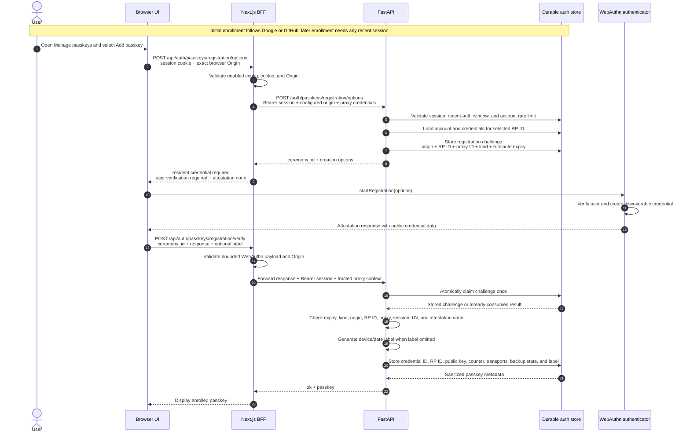
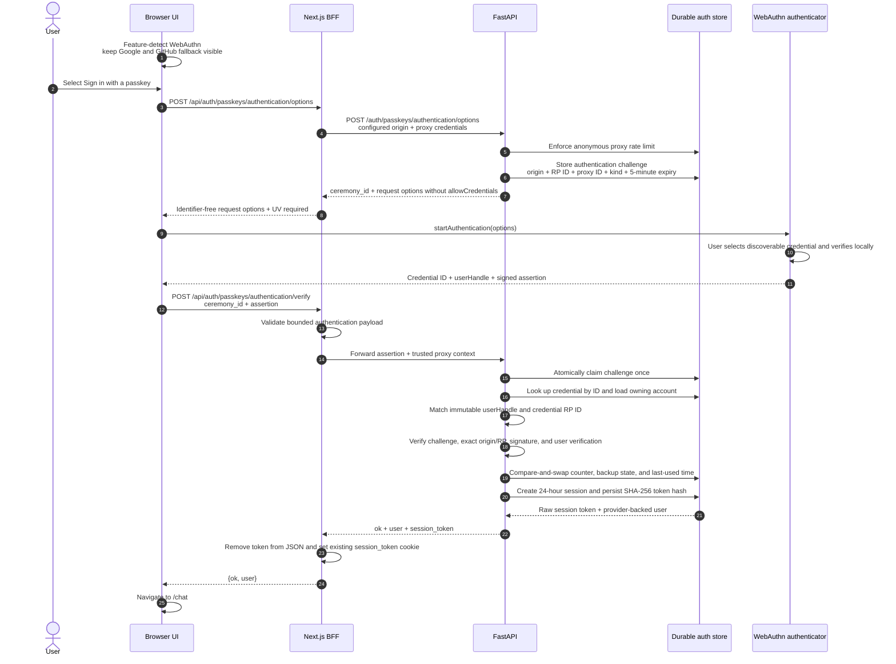
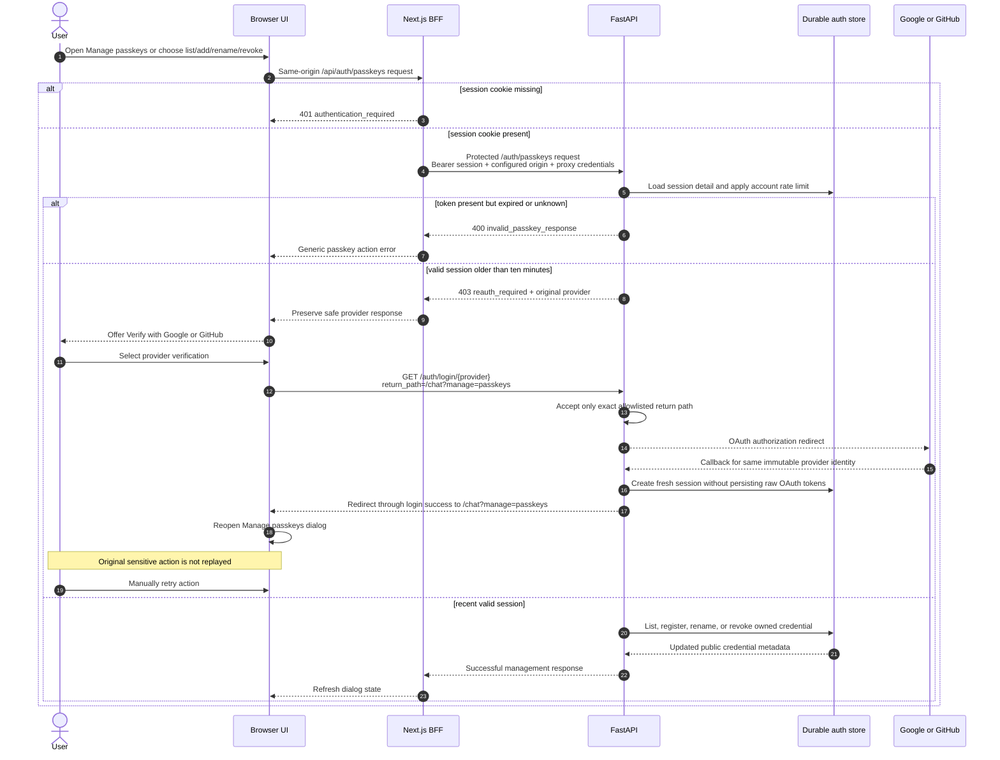

# Passkey Authentication

Passkeys provide explicit, identifier-free sign-in while Google or GitHub
remains the enrollment and recovery path. Browser WebAuthn calls stay in UI;
Next.js route handlers form trusted BFF; FastAPI verifies ceremonies and stores
durable account, credential, challenge, and session records.

Return to [documentation index](../README.md).

## Architecture and trust boundaries

| Layer              | Responsibility                                                                                                                                                                               |
| ------------------ | -------------------------------------------------------------------------------------------------------------------------------------------------------------------------------------------- |
| Browser UI         | Feature-detect WebAuthn, keep Google/GitHub fallback visible, start ceremonies, and handle cancellation without treating it as an account failure.                                           |
| Next.js BFF        | Validate bounded payloads, add configured origin and proxy credentials, forward session cookie for protected operations, and keep backend session token out of authentication response body. |
| FastAPI            | Authenticate trusted BFF, enforce origin/RP/session/rate policies, generate options, verify WebAuthn responses, and return generic ceremony errors.                                          |
| Durable auth store | Persist accounts, credential public material, one-time challenges, counters, and SHA-256 session-token hashes. SQLite, PostgreSQL, and Cosmos DB adapters share this contract.               |
| Authenticator      | Create and use private credentials after local user verification. Private keys and biometric data never leave authenticator.                                                                 |

Browser calls only same-origin `/api/auth/passkeys/*` routes. Every BFF request
to backend supplies configured `X-Passkey-Origin`, proxy ID, and proxy secret.
Protected operations also forward current `session_token` as bearer session.
Registration, rename, and revoke BFF routes check incoming browser `Origin`
exactly; authentication routes and list route do not universally depend on that
header. Backend still binds every ceremony to configured exact origin and one
selected RP ID.

## 1. Passkey enrollment

First passkey enrollment requires Google or GitHub because account and immutable
WebAuthn user handle are created from provider identity. Additional passkeys can
be enrolled after any recent authenticated session, including fresh passkey
sign-in. Authentication must be no older than ten minutes.



Registration requests discoverable resident credentials, requires user
verification, and accepts only verified `attestation: "none"`. Existing
credentials are excluded only for RP ID selected from current origin. Account is
limited to ten passkeys. Omitted label becomes backend-generated label such as
`Device passkey · Aug 3, 2026`; explicit labels are trimmed and limited to 100
Unicode code points.

Challenge is claimed before session or cryptographic validation. Failed first
verification therefore consumes challenge and prevents replay.

## 2. Identifier-free passkey sign-in

Sign-in options omit `allowCredentials`, so authenticator discovers eligible
credentials for current RP. User does not enter email or provider identifier.



Backend resolves account from returned credential ID and requires returned
`userHandle` to match account's opaque immutable handle. Source provider remains
`google` or `github`; session can additionally expose `auth_method: "passkey"`.
Google and GitHub identities are never auto-linked by matching email.

BFF is only browser-facing component that receives raw passkey session token.
It sets existing 24-hour JavaScript-readable `session_token` cookie and returns
only `{ok, user}`. Durable store keeps only token's SHA-256 hash. Refresh does not
advance `authenticated_at`, so it cannot bypass recent-auth requirement.

Browser cancellation or timeout is neutral; OAuth buttons remain available.

## 3. Management and OAuth reauthentication

List, add, rename, and revoke require valid session authenticated within ten
minutes. Final passkey can be deleted because OAuth recovery remains mandatory.
No management action is replayed after reauthentication.



Missing browser cookie is rejected by BFF with 401; backend request without
Bearer session also returns 401. Current backend behavior for present expired or
unknown token is generic `400 invalid_passkey_response`. Only valid but stale
session returns `403 {"code":"reauth_required","provider":"google|github"}`.

## Endpoints

| UI BFF route                                     | Backend route                                | Session required   |
| ------------------------------------------------ | -------------------------------------------- | ------------------ |
| `POST /api/auth/passkeys/registration/options`   | `POST /auth/passkeys/registration/options`   | Yes, recent        |
| `POST /api/auth/passkeys/registration/verify`    | `POST /auth/passkeys/registration/verify`    | Yes, recent        |
| `POST /api/auth/passkeys/authentication/options` | `POST /auth/passkeys/authentication/options` | No                 |
| `POST /api/auth/passkeys/authentication/verify`  | `POST /auth/passkeys/authentication/verify`  | No; issues session |
| `GET /api/auth/passkeys`                         | `GET /auth/passkeys`                         | Yes, recent        |
| `PATCH /api/auth/passkeys/{credentialId}`        | `PATCH /auth/passkeys/{credential_id}`       | Yes, recent        |
| `DELETE /api/auth/passkeys/{credentialId}`       | `DELETE /auth/passkeys/{credential_id}`      | Yes, recent        |

Backend passkey endpoints trust only BFF requests carrying matching proxy ID,
proxy secret, and configured origin. Browser payloads are limited to 64 KiB.
Default limits are 20 authenticated operations per minute per account and 300
anonymous ceremony calls per minute per proxy.

## Multi-domain RP configuration

One backend can serve multiple unrelated frontend domains, but each WebAuthn
ceremony uses exactly one RP ID. Canonical deployment uses `FRONTEND_URLS` as
sole origin list and enables backend derivation explicitly:

```env
FRONTEND_URLS=https://ui.example.com,https://bmo-deepagent-ui.vercel.app
PASSKEY_DERIVE_FROM_FRONTEND_URLS=true
PASSKEY_ENABLED=true
```

Each entry must be exact origin: scheme and host with optional port, root path only,
no credentials, query, fragment, or wildcard. Production requires HTTPS; loopback
development may use HTTP. Backend rejects invalid hosts, empty entries, duplicate
normalized origins, and any present `PASSKEY_RP_ID`, `PASSKEY_RP_IDS`, or
`PASSKEY_ORIGINS` while derivation is enabled. Each accepted origin maps to own
normalized hostname RP ID. Reserved mapping is exactly
`("https://bmo-deepagent-ui.vercel.app", "bmo-deepagent-ui.vercel.app")`.

Credentials are bound to selected RP ID. Unrelated domains therefore require
separate enrollment even for same provider account; management lists account's
credentials across RPs. Reserved Vercel mapping is covered by backend configuration
and tests only during current Azure rollout.

Legacy explicit mode remains when `PASSKEY_DERIVE_FROM_FRONTEND_URLS` is absent or
`false`: configure `PASSKEY_ORIGINS` and exactly one of `PASSKEY_RP_IDS` or singular
`PASSKEY_RP_ID`. Never mix canonical and explicit settings.

## Azure rollout contract

Container Apps environment `defaultDomain` is source of truth for Azure UI/backend
URLs. Resolver validates environment resource ID/state/domain and app names using one
environment query before builds; it never creates placeholder apps or queries app
FQDNs. Scripts parse strict quoted assignments safely, including resource groups with
parentheses. Metadata is recorded in `.resolved-azure-endpoints.json` only after
deployment verification; `env.sh` is never rewritten.

When endpoints change, update exact Google redirect URI, GitHub callback, and GitHub
homepage printed by resolver, then set process-local
`OAUTH_REDIRECTS_CONFIRMED=true`. Environment recreation may change provider values;
update them before traffic.

Backend deploys first. Then run UI `./build.sh` once to publish Docker Hub image and
write `.deployment-build.json`; run `./deploy-azure-container-app.sh` once to consume
that pinned image. UI deploy never builds. Current rollout does not configure, build,
deploy, or verify Vercel.

`PASSKEY_PROXY_SECRET` remains server-only Key Vault runtime secret shared by backend
and UI BFF; `.env.docker` and image must not contain it or deployment-owned passkey
keys. Sanitizer removes legacy private dotenv assignments atomically and reports a
recovery backup if safe restore cannot finish; it never prints values.

## Persistence and deployment

Stored data includes immutable provider account identity, globally unique opaque
WebAuthn user handle, credential ID/public key/counter/transports/backup state,
labels/timestamps/RP binding, challenges, and hashed sessions. Backend removes
raw OAuth tokens before persistence and never stores authenticator private keys
or biometric information.

Challenges expire after five minutes and are atomically consumed on first
verification attempt. Bounded startup and lazy cleanup remove expired challenges
and sessions.

For Azure Container Apps demo, SQLite database must be on durable Azure File
mount, use SMB-compatible journal mode, and run one application replica. Use
PostgreSQL or Cosmos DB adapters for multi-replica production. See
[backend OAuth and passkey deployment guide](https://github.com/jerryshao2012/deep-research/blob/main/README.md#-oauth-authentication).
