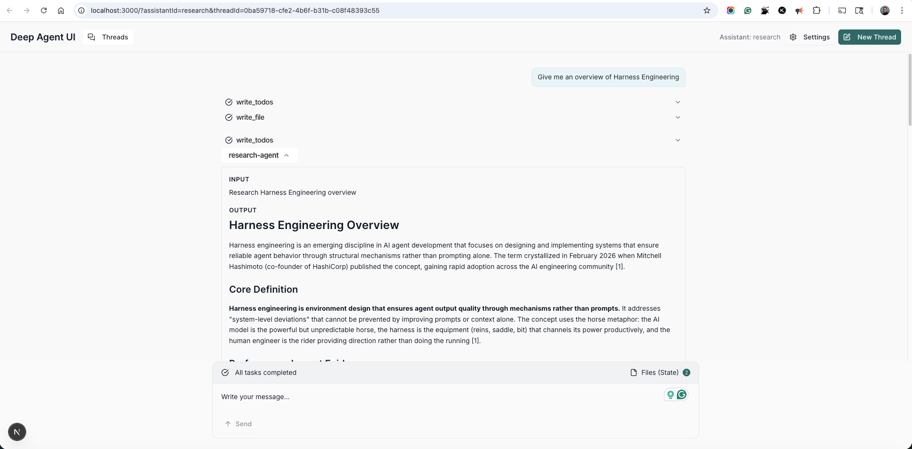

# Deep Research

[documentation index](../README.md)

Use chat to submit a research request, follow agent activity, read the response,
and inspect files generated in thread state. This guide covers the UI workflow
after a compatible agent connection is configured; it does not define backend or
model setup.

## Run a research request

1. Enter a focused question or research task in the message composer.
2. Press `Enter` or select Send. Use `Shift+Enter` when the request needs another
   line.
3. Wait for the agent response. While this UI is loading the current streamed run,
   the composer is locked and the Send control becomes Stop.

## Follow task execution

1. Read tool activity inline with the streamed conversation.
2. Open Tasks when the agent publishes a task list. Items are grouped as Pending,
   In Progress, and Completed.
3. When the run finishes, read the rendered assistant response in the same
   conversation.

_Completed run keeps tool progress, rendered report, and generated state files in one workflow._

## Review generated files

1. Open **Files (State)** when it appears. The badge reports how many files the
   current thread state contains.
2. Select a file to open its content in the file viewer. Report and draft icons are
   derived from filenames such as `final_report`, `_verified`, and `draft`.
3. Return to the conversation to compare generated material with the rendered
   response and tool activity.

## Troubleshooting

- No task panel: the current run has not published task state. Tool activity can
  still appear in the conversation.
- No Files (State) control: the thread state contains no generated files yet.
- Request does not start: confirm the composer contains text and no run, upload,
  or ingestion operation is locking it.
- Backend error: review the error shown above the conversation, then check the
  configured deployment before retrying.
- Treat generated reports and files as agent output, not automatically verified
  facts. Review sources before relying on them, and do not place secrets or
  sensitive data in requests that the configured backend should not receive.
