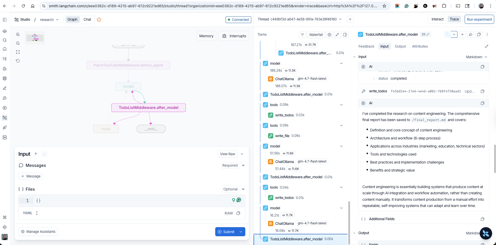

# LangSmith Trace Inspection

[documentation index](../README.md)

Use external LangSmith Studio to inspect graph execution and trace details for a
completed research run. This UI does not automatically open LangSmith, construct
trace links, configure tracing, or guarantee that a backend run is traced.

## Scope and prerequisites

- Use a separately configured LangSmith workspace and project that contains the
  research run you need to inspect.
- Confirm you have permission to view that project and its run data.
- `NEXT_PUBLIC_LANGSMITH_API_KEY` is optional client-side configuration for local
  development, as documented in the repository README. It is not production
  tracing setup.

## Inspect graph execution

1. Open the completed run in LangSmith Studio outside this UI.
2. Use the graph panel to follow the executed nodes and select the part of the run
   that needs inspection.
3. Correlate the selected node with its entry in the turn waterfall and timing
   panels.

_Trace view correlates graph nodes, timing, tool calls, model calls, inputs, and outputs._

## Interpret trace

1. Read graph nodes as the run's execution flow, then use the waterfall to compare
   ordering and duration.
2. Expand tool and model calls to locate the operation responsible for a result,
   delay, or failure.
3. Inspect that call's input and output to understand what it received and
   returned. Apply access controls appropriate to the data recorded in traces.

## Security and troubleshooting

- Missing run: verify tracing where the agent executes, then confirm the selected
  LangSmith workspace and project. UI settings alone do not establish trace
  capture.
- Access error: confirm external LangSmith credentials and project permissions;
  this UI does not repair Studio access.
- Missing detail: inspect parent and child calls around the selected graph node;
  available detail depends on backend instrumentation.
- Never place production secrets in `NEXT_PUBLIC_*` variables. Keep production
  LangSmith credentials server-side, and do not copy sensitive trace inputs or
  outputs into tickets, screenshots, or public documentation.
