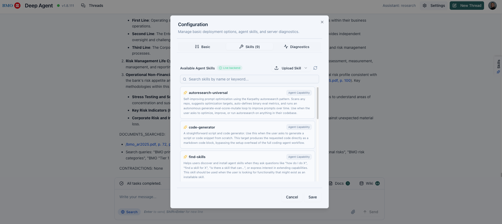
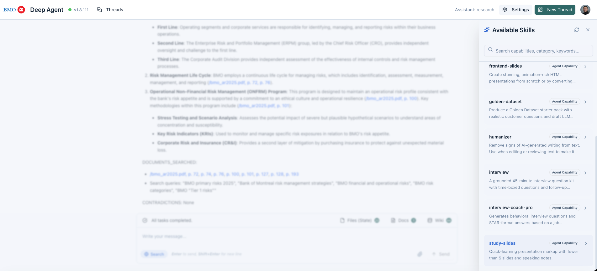
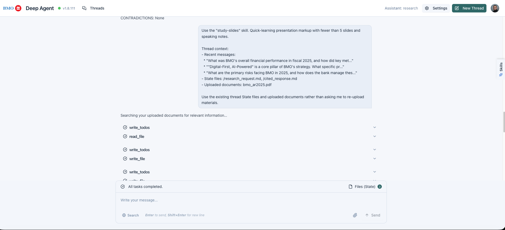
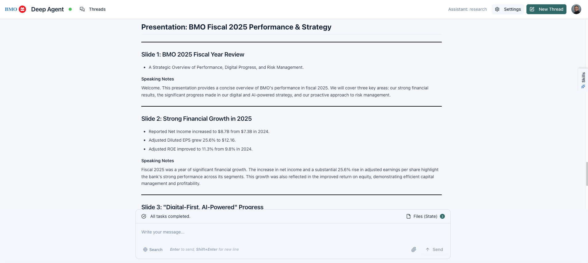

# Skills

[documentation index](../README.md)

Use skills to prepare an explicit, context-aware request for a capability exposed
by the configured backend. Selecting a skill drafts a chat request for review; it
does not send the request or execute the skill locally.

## Configure skills

1. Open Settings and select the **Skills** tab.
2. Review backend status and the loaded skill list. A live response from
   `GET /skills` produces live backend data; an unavailable, disconnected, or
   malformed response does not.
3. Refresh after changing the deployment connection. Upload and removal are
   available only when a live backend implements the corresponding endpoints;
   removable controls apply only to skills marked as uploaded or removable.

_Configuration distinguishes live backend skill data from an unavailable or disconnected backend._

## Browse and select

1. Open **Available Skills** from the current chat.
2. Search by skill name, description, category, or keyword. Refresh to request the
   list again.
3. Select the capability that matches the task.

_Searchable catalog helps choose a capability without leaving current thread._

## Apply a skill

1. Selecting a skill adds `Use the "<skill>" skill...` and its description to the
   composer.
2. When available, the draft also includes recent human-message excerpts, task
   progress, state filenames, uploaded document names, and an instruction to reuse
   existing thread materials.
3. Review or edit the draft, then send it as a normal chat request. Selection does
   not submit automatically.

_Selecting a skill prepares explicit invocation text while preserving current thread context._

## Review result

Read the returned output in the same conversation. Validate it against the task
and source materials; actual capability and output depend on the configured
backend and selected skill.

_Completed response shows skill output in same conversation where it was requested._

## Troubleshooting

- No skills appear: verify deployment configuration, refresh the list, and confirm
  the backend returns a `skills` array from `GET /skills`.
- Search is empty: clear or broaden the query; matching uses name, description,
  category, and keywords.
- Upload or removal fails: confirm the connected live backend supports
  `POST /skills/upload` or `DELETE /skills/<skill-id>`. Endpoint support is not
  universal.
- Skill is not applied: keep the explicit invocation text in the composer and send
  the request after review.
- Before sending, remove sensitive details from recent message excerpts and file
  or document names added to the draft. Backend access and data handling remain
  deployment responsibilities.
