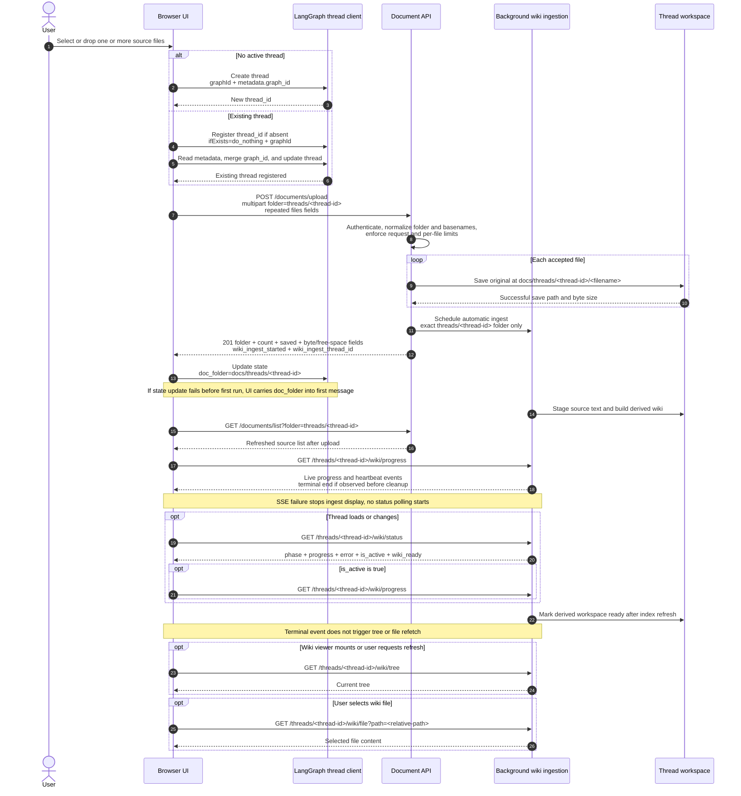
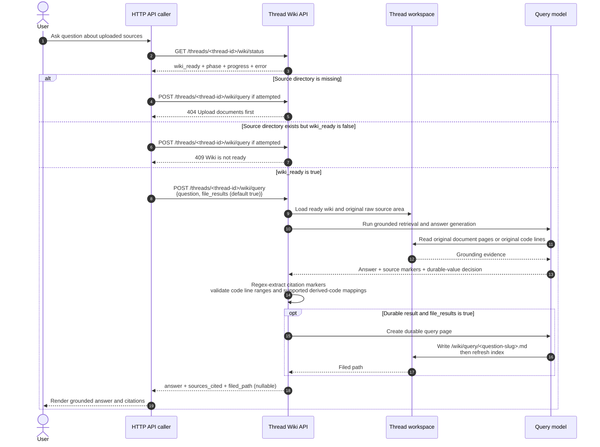

# LLM Wiki Document Upload and Query

LLM Wiki turns documents attached to one research thread into an isolated,
filesystem-backed knowledge workspace. Browser UI registers thread, uploads
sources through document API, records source folder in LangGraph state, follows
background ingestion, and exposes derived workspace for inspection. Query route
then asks model to answer against original sources, extracts structured citation
markers, validates code line ranges, and may file durable answer back into wiki.

Return to [documentation index](../README.md).

## Architecture and responsibility boundaries

| Layer                     | Responsibility                                                                                                                                                                                                 |
| ------------------------- | -------------------------------------------------------------------------------------------------------------------------------------------------------------------------------------------------------------- |
| Browser UI                | Create or register thread, preserve graph metadata, submit multipart files, update `doc_folder`, display upload/ingest errors, follow progress, and refresh source list plus wiki tree/file views.              |
| LangGraph thread client   | Create new thread or idempotently register existing one, store `graph_id` metadata, and persist `doc_folder` in thread state or on first run when immediate state update is unavailable.                        |
| Document API              | Authenticate upload/list/delete operations, constrain paths and sizes, save original files under documents root, report save results, and schedule automatic wiki ingest for exact thread-folder uploads.      |
| Background wiki ingestion | Register per-thread progress, stage supported source content, build or update derived workspace, expose status/SSE progress, honor cancellation checkpoints, and finish with ready, error, or cancelled state. |
| Thread workspace          | Keep original sources and backend-managed derived wiki separate. Provide safe tree and text-file inspection without exposing arbitrary filesystem paths.                                                       |
| Query model               | Retrieve grounded evidence, generate answer, decide whether result has durable value, and optionally write query page. Runtime regex-extracts citation markers; only code line ranges and supported derived-code mappings receive source validation.              |

### Thread isolation and context use

Upload form uses logical folder `threads/<thread-id>`. Document API resolves it
under documents root, so original sources live at
`docs/threads/<thread-id>/`. Derived workspace is backend-managed at
`threads-wiki/<thread-id>/` (physically `docs/threads-wiki/<thread-id>/` in
current backend layout). Do not upload directly into derived workspace or make
clients depend on its internal indexes.

Thread ID is storage boundary, not authorization boundary. Current wiki handlers
authenticate requests but do not enforce per-thread ownership. Multi-user
deployments must enforce ownership at trusted gateway or application boundary.

UI records `doc_folder: docs/threads/<thread-id>` in LangGraph thread state so
research flow can find attached sources. LLM Wiki context remains explicit:
normal research request does not automatically receive wiki contents. Research
agent must invoke `llm_wiki_query` when wiki answer is needed.

## 1. Upload and automatic ingestion

New upload can create thread before any research run. Existing thread is
idempotently registered, then current metadata is merged with normalized graph
ID. UI maps missing or legacy `researcher` graph ID to `research`.



### Authentication headers

| Surface | Static key | OAuth application session | Selection behavior |
| ------- | ---------- | ------------------------- | ------------------ |
| Document API | `X-API-Key: <static-key>` only | `X-API-Key: <session-token>` or `Authorization: Bearer <session-token>` | Static-key configuration uses `UPLOAD_API_KEY`, then `LANGCHAIN_API_KEY`, then process-local generated fallback. |
| Thread Wiki API | `X-API-Key: <static-key>` or `Authorization: Bearer <static-key>` | `X-API-Key: <session-token>` or `Authorization: Bearer <session-token>` | `X-API-Key` wins when both headers exist. Configured key selection uses `LANGCHAIN_API_KEY`, then `UPLOAD_API_KEY`; no generated fallback. |

Document API also gives any nonempty `X-API-Key` header precedence over Bearer
session. Bearer is considered only when `X-API-Key` is absent. An invalid
`X-API-Key` therefore shadows valid Bearer session and produces 401.

Browser integration currently sends application session token through
`X-API-Key` and uses authenticated request wrapper. On 401, wrapper coordinates
one session refresh per backend origin, retries request once when refresh
succeeds, and routes invalid session back to login when refresh fails.

### Multipart and storage contract

`POST /documents/upload` expects `multipart/form-data`:

```text
folder=threads/<thread-id>
files=<source-file-1>
files=<source-file-2>
```

- `files` is required and repeatable. Missing multipart field is FastAPI
  validation error.
- `folder` defaults to `policy`, but LLM Wiki auto-ingest requires normalized
  value to have exactly two parts: `threads/<thread-id>`.
- Folder normalization converts backslashes to `/`, trims whitespace and outer
  slashes, and collapses `.` or repeated separators. Empty paths and any
  remaining `..` component are rejected with 400.
- Uploaded filename is reduced to basename. Existing same-name file is opened
  for replacement; directory components supplied by client are not retained.
- Default `MAX_UPLOAD_SIZE_MB` is 500. When `Content-Length` is present, entire
  request must fit limit; every individual file is also checked against same
  byte limit. Either violation returns 413.
- Upload route stores files without extension allowlist. Ingestion uses only
  supported document, text, data, and source-code inputs; unsupported content
  can be stored but may not produce useful wiki evidence.

Successful upload returns HTTP 201 with:

| Field | Meaning |
| ----- | ------- |
| `folder` | Normalized relative folder. |
| `count` | Number of saved files. |
| `saved` | Per-file `filename`, application-relative `path` such as `docs/threads/<thread-id>/<filename>`, and byte `size`. |
| `total_uploaded_bytes` | Sum of saved file sizes for request. |
| `free_space_bytes` | Remaining bytes on backing filesystem, or `-1` if unavailable. |
| `free_space_human` | Human-readable rendering of free-space result. |
| `wiki_ingest_started` | Whether endpoint scheduled automatic ingest because folder exactly matched thread pattern. |
| `wiki_ingest_thread_id` | Thread ID when ingest was scheduled; otherwise `null`. |

`wiki_ingest_started: true` confirms scheduling, not successful completion.
Open `/wiki/progress` promptly for live state. UI checks `/wiki/status` once when
thread loads or changes and opens SSE only when status reports active ingest; it
does not poll status after SSE failure.

Terminal ingest error/cancel state is not durable through status API. Worker
removes terminal entry from in-memory registry during cleanup. SSE can deliver
terminal error/cancel event if it reads entry first, but can instead report
derived `ready` or `idle` if cleanup wins. A later `/wiki/status` also derives
`ready`/`idle` from workspace, with `error: null`. Preserve live failure event
when received, inspect server logs, and decide retry from current `wiki_ready`
and source/workspace state rather than expecting historical terminal error.

Upload batch is not transactional. Route writes files sequentially and starts
auto-ingest only after all saves finish. If later filename, size, or write fails,
request returns error and no upload response with partial results; files saved
earlier in request are not rolled back. List thread folder before retrying to
avoid overlooking partial state or replacing same-name files.

## 2. Query ready wiki

For direct HTTP API caller, query is separate authenticated operation. Caller
should first require `wiki_ready: true`; server independently enforces same
readiness and returns 409 otherwise. `file_results` defaults to `true` when
omitted. Query first resolves `docs/threads/<thread-id>`: missing source
directory returns 404. Existing source directory with empty or unready wiki
returns 409.



Request body:

```json
{
  "question": "<question-about-uploaded-sources>",
  "file_results": true
}
```

Response fields:

| Field | Meaning |
| ----- | ------- |
| `answer` | Generated answer, including grounding markers used for citation extraction. |
| `sources_cited` | Regex-extracted citation markers with source kind and applicable raw path, page, locator, URL, or line range. Code line ranges and supported derived-code mappings are source-validated; other markers are not generally checked for existence or reachability. |
| `filed_path` | `/wiki/query/<slug>.md` when durable filing completes; otherwise `null`. |

Filing needs both model durable-value decision and `file_results: true`.
Disabling filing does not disable answer generation or citations. Filing timeout
or skipped decision also leaves `filed_path` null.

Original uploaded documents are evidence. Grounded document citations point to
original raw pages; code citations point to validated original line ranges.
Derived indexes, `/raw/_code/` navigation entries, and semantic chunks help
retrieval but are not citation targets. Runtime regex-extracts URLs, section
references, raw paths, pages, and locators without general existence or URL
reachability checks. It validates code line ranges against source files, maps
supported derived-code citations back to originals, and drops invalid ranges.

Research-agent path is separate from HTTP sequence. Explicit `llm_wiki_query`
tool derives thread from state `doc_folder`, checks local wiki content, and calls
`run_query(..., file_results=False)` directly in backend process. It does not
authenticate against or call `/wiki/status` or `/wiki/query`, and it never files
query result. Setting `doc_folder` or completing ingestion does not inject wiki
into every research-agent prompt.

## Focused endpoints

### Documents

| Method and path | Input | Result and wiki consequence |
| --------------- | ----- | --------------------------- |
| `POST /documents/upload` | Multipart repeated `files`; `folder=threads/<thread-id>` | HTTP 201 save report; exact thread folder schedules automatic ingest. |
| `GET /documents/list?folder=threads/<thread-id>` | Thread folder query | Sorted `items` of direct files/folders with `folder` and `count`. |
| `DELETE /documents/{filename}?folder=threads/<thread-id>` | Basename path plus thread folder query | Deletes one source; background hook cancels conflicting ingest, removes source-derived references, and starts reconciliation. |
| `DELETE /documents/folder/{folder}` | One-segment folder path only | Deletes direct files and preserves nested directories. Route parameter does not capture `/`, so it cannot target nested `threads/<thread-id>` or trigger thread-folder reconciliation. |

### LLM Wiki

| Method and path | Input | Result |
| --------------- | ----- | ------ |
| `POST /threads/<thread-id>/wiki/ingest` | Optional JSON `topic`, `note` | Starts background ingest; cancels and replaces active ingest for same thread. |
| `GET /threads/<thread-id>/wiki/status` | None | Current phase, progress, detail, counts, error, timestamps, activity, and `wiki_ready`. |
| `GET /threads/<thread-id>/wiki/progress` | None | SSE `progress`, `heartbeat`, and `end`; after registry cleanup, `end` can contain derived ready/idle instead of original terminal failure/cancel state. |
| `POST /threads/<thread-id>/wiki/ingest/cancel` | None | Requests cancellation and reports `cancelled`; worker stops at next checkpoint. |
| `GET /threads/<thread-id>/wiki/tree` | None | Workspace tree and `file_count`; 404 before workspace exists. |
| `GET /threads/<thread-id>/wiki/file?path=<relative-path>` | Safe relative path | Text content and file metadata; `.pkl` and `index/*` content is hidden. |
| `POST /threads/<thread-id>/wiki/query` | JSON `question`, optional `file_results` | Grounded `answer`, `sources_cited`, and nullable `filed_path`; 404 when source directory is missing, 409 when it exists but wiki is unready. |
| `DELETE /threads/<thread-id>/wiki` | None | Cancels ingest, recursively deletes uploaded thread sources and derived wiki, and clears thread cache. |

Complete backend contracts remain in maintained
[Document upload API guide](https://github.com/jerryshao2012/deep-research/blob/main/documents/api/upload.md)
and
[Thread Wiki API guide](https://github.com/jerryshao2012/deep-research/blob/main/documents/api/wiki.md).

## Cancellation, deletion, and retry

- Cancel returns immediately; background worker observes request at next phase
  checkpoint. Preserve live SSE `cancelled` event if received; later status is
  current ready/idle state, not durable cancellation history.
- Manual ingest is retry operation. Posting new ingest cancels and replaces any
  active ingest for thread. After `error` or `cancelled`, correct source/config
  issue and post ingest again.
- Single-source deletion is immediate, while cleanup/reconciliation is
  background work. Delete response does not prove derived wiki is already
  reconciled, and delete hook has no dedicated completion response. Inspect
  tree/query results after background work, or run manual ingest for observable
  progress; see backend wiki guide for reconciliation detail.
- Folder-content deletion accepts only one path segment and removes only direct
  files. It cannot target nested `threads/<thread-id>`. Delete thread sources
  individually, or use thread-wiki deletion when both sources and derived wiki
  should be removed.
- Thread-wiki deletion is broader and destructive: both
  `docs/threads/<thread-id>/` and backend-managed derived workspace are removed.
  A later query needs fresh upload and ingest.

## Troubleshooting and deployment restrictions

- `401`: credential is missing, invalid, or expired. Upload accepts static key
  only in `X-API-Key`; OAuth session accepts either supported header. Wiki has no
  process-local generated-key fallback. Browser may refresh session once and
  retry; persistent 401 requires sign-in or deployment key correction. On
  Document API, remove invalid `X-API-Key` before retrying valid Bearer session.
- `404`: query cannot find `docs/threads/<thread-id>`; document folder/file,
  wiki workspace, or requested wiki file may also be missing. Confirm same
  `<thread-id>` across upload, status, tree, file, and query. Status itself can
  return `idle` for unseen ID; tree/file return 404 until workspace exists.
- `409`: query found source directory but `_wiki_is_ready` did not detect
  populated wiki index. Wait for `wiki_ready: true`; phase alone is not
  readiness contract.
- `500` during Wiki authentication: neither `LANGCHAIN_API_KEY` nor
  `UPLOAD_API_KEY` is configured and supplied credential is not valid OAuth
  session. Backend reports `LANGCHAIN_API_KEY not set`; configure static key or
  supply valid session.
- `413`: request `Content-Length` or an individual file exceeds configured
  upload limit. Reduce request/file size or change backend limit deliberately.
- `422`: required multipart `files` field or query `question` is absent/invalid.
- Ingest stalled: inspect live SSE progress/heartbeat and server logs. UI does
  not automatically poll after stream failure. Fetch current status manually;
  after worker cleanup it may report ready/idle with null error. Cancel only
  active work and retry based on current `wiki_ready` plus source/workspace state.
- Query timeout currently returns normal query response with explanatory
  `answer`, empty `sources_cited`, and null `filed_path`; distinguish this from
  HTTP transport failure.
- AWS demo read-only mode returns 503 for persisted mutations in this workflow:
  upload, document delete, ingest, cancel, query, and thread-wiki delete. Read
  operations such as list, status, progress, tree, and file remain available.
  `file_results: false` does not bypass query restriction because route itself
  is blocked in read-only mode. LangGraph thread creation/registration, thread
  metadata update, and state update also return 503; browser upload flow may
  therefore stop before it reaches Document API.
